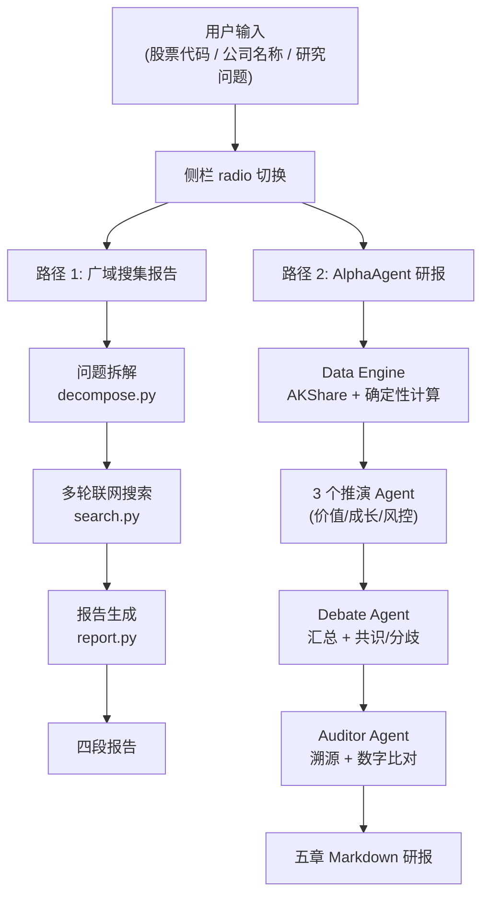
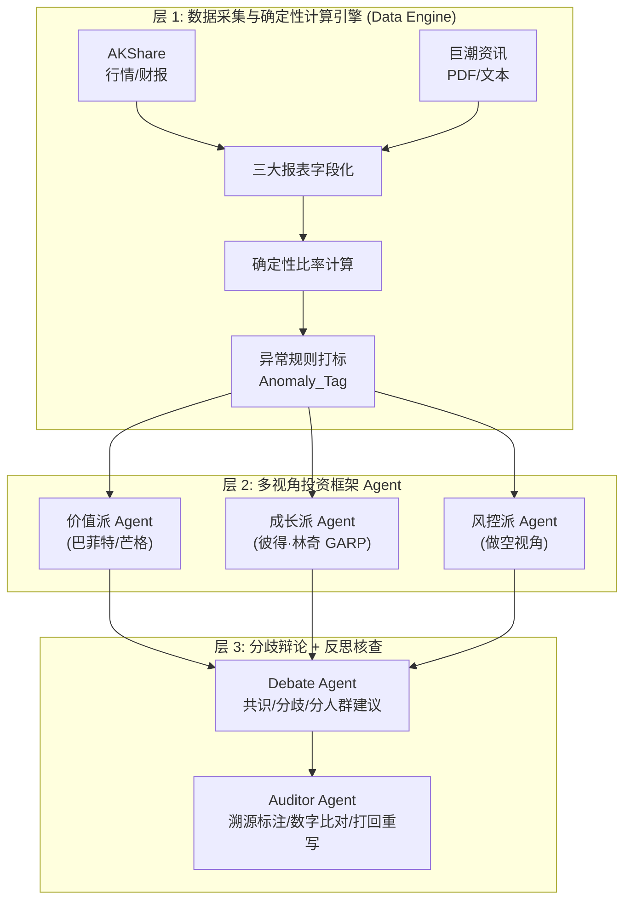

# Druce — 多视角 AI 金融投研助手

> 零幻觉底座 · 多 Agent 博弈 · 可追溯核查
> 花五分钟得到别人花五小时手动搜索才能凑齐的行业情报。

Druce 是一个面向个人投资者的 AI 投研助手。它通过 **确定性代码计算** 保证财务数据零幻觉，通过 **多视角 Agent 并行推演**（价值派 / 成长派 / 风控派）打破单一 LLM 的平庸观点，通过 **反思核查 Agent** 逐句比对数据来源、剔除数字幻觉。

[项目演示视频地址](https://www.bilibili.com/video/BV1kMu56iEUA/?vd_source=aad3333de5766b8afc3d7822bb7148b7)

---

## 1. 产品定位与架构

### 1.1 双路共存

Druce 同时支持两种报告路径，用户在侧栏 radio 切换：

| 路径 | 名称 | 数据基底 | 输出形态 | 延迟 |
|------|------|----------|----------|------|
| 路径 1 | 广域搜集报告 | Tavily/Bing 搜索 + 巨潮资讯抓取 | 四段（摘要/分点/风险/参考） | 1-3 分钟 |
| 路径 2 | AlphaAgent 研报 | AKShare 财务数据 + 多 Agent 推演 | 五章 Markdown 研报 | 待实测 |



### 1.2 路径 2 三层架构

路径 2（AlphaAgent 研报）采用 **"确定性计算 + 多 Agent 协同推演 + 反思审核"** 三层架构：



**LLM 多 provider 路由**（grilling 3.2 拍板 e）：

| Agent 角色 | LLM | 理由 |
|------------|-----|------|
| 价值派 / 成长派 / 风控派 | DeepSeek | 便宜，推演逻辑可由 prompt 引导 |
| Debate Agent | GPT-4o | 强，做汇总裁决质量更高 |
| Auditor Agent | DeepSeek | 便宜，做数字比对逻辑性强 |

---

## 2. 核心模块清单

### 2.1 Data Engine（`app/dataengine/`）

| 模块 | 职责 | 对应 PRD |
|------|------|----------|
| `akshare_client.py` | AKShare 行情/财报拉取 + 文件缓存（财报 TTL 7 天，行情 TTL 1 天）+ 公司名→股票代码 resolver | §3.1 |
| `financial_statements.py` | 三大报表字段化提取，区分年报行（12-31 结尾）/季报行 | §3.1 |
| `ratios.py` | 确定性计算 ROE / 毛利率 / 净利率 / 资产负债率 / PEG / 应收账款周转天数 / 经营性现金流-净利润比值 | §3.1 |
| `anomaly_tags.py` | 异常规则打标（应收账款增速 > 营收增速 + 15% 等），输出 `[Anomaly_Tag]` 列表 | §3.1 |
| `cninfo_client.py` | 巨潮资讯网 PDF/文本抓取，供第四章溯源 | §3.1 |
| `thresholds.py` | 量化阈值定义（ROE > 15%、资产负债率 < 40% 等） | §3.2 |

### 2.2 多 Agent（`app/agents/`）

| 模块 | 职责 | 对应 PRD |
|------|------|----------|
| `value_agent.py` | 价值派 Agent（巴菲特/芒格视角）：护城河、ROE 稳定性、FCF、债务风险 | §3.2 |
| `growth_agent.py` | 成长派 Agent（彼得·林奇 GARP 视角）：营收/净利增速、PEG、存货匹配度 | §3.2 |
| `risk_agent.py` | 风控派 Agent（做空视角）：财报隐患、非经常性损益占比、现金流断裂 | §3.2 |
| `debate_agent.py` | 分歧辩论与综合研判：汇总 3 个推演输出，生成多视角对比矩阵 + 共识/分歧 + 分人群建议 | §3.3 |
| `auditor_agent.py` | 反思核查与数据可追溯：溯源标注、报告数字 vs AKShare 原始数据比对、不符则打回重写 | §3.4 |

### 2.3 编排与前端

| 模块 | 职责 | 对应 PRD |
|------|------|----------|
| `pipeline_v2.py` | 路径 2 编排：Data Engine → 3 推演 Agent → Debate → Auditor，emit 进度回调 | §4 |
| `pipeline.py` | 路径 1 编排：拆解 → 搜索 → 验证 → 报告 | 现有 |
| `streamlit_app.py` | Streamlit 单页前端，侧栏 radio 切换 path1/path2 | §1.1 |
| `llm.py` | 多 provider LLM 路由（OpenAI 兼容 / DeepSeek / GPT-4o） | §3.2 |
| `config.py` | 环境变量与运行配置，`has_llm` / `has_search` / `is_mock` 三属性判定模式 | — |

---

## 3. 五章输出规范

路径 2 的 AlphaAgent 研报严格遵循 PRD v2 第四章的五章 Markdown 结构：

| 章节 | 定位 | 关键内容 |
|------|------|----------|
| **第一章** 摘要与多视角判定矩阵 | 结论先行仪表盘，1 分钟掌握核心分歧 | 公司摘要、投资视角碰撞矩阵、共识/分歧总结 |
| **第二章** 基础数据与确定性指标分析 | 零幻觉底座，所有数据由 Python/AKShare 确定性计算 | 财务健康度硬指标表、估值与市场表现表、异常指标自动预警 |
| **第三章** 经典投资框架深度推演 | 3 个独立 Agent 站在不同投资哲学下深度推演 | 价值派（巴菲特/芒格）、成长派（彼得·林奇 GARP）、风控派（做空视角），每个含核心指标阈值表 + 硬性判定规则 + Agent 推演输出 |
| **第四章** 数据可追溯性与事实核查 | 展现 AI 设计的严谨性，解决大模型幻觉 | 关键事实溯源表（指标 × 近 5 年报告年份，每格数值 + 出处页码）、审查 Agent 修正记录 |
| **第五章** 情景推演与投资策略建议 | 从分析走向落地决策 | 乐观/中性/悲观三种情景下的估值与策略、分人群操作建议表（保守型/稳健型/激进型） |

---

## 4. 核心模块截图

> **⚠️ 截图待补** — 以下为占位标记，需启动 `uv run python run.py` 后拍摄并回填。

### S1：侧栏路径切换 + 巨潮参数配置

<!-- TODO: S1 — 截侧栏 path1/path2 radio + 巨潮公司简称/交易所归属配置 -->


### S2：路径 2 端到端五章研报渲染

<!-- TODO: S2 — path2 输入"平安银行"后截主区域五章 Markdown 渲染 -->


### S3：路径 1 广域搜集报告（论点卡片 + 信源折叠）


---

## 5. 性能数据

> **⚠️ 性能数据待实测** — 以下表格中标注 `待实测` 的项需通过 `tests/test_latency.py` 补测。
> 标注 `假数据` 的项为占位估算值，**不代表真实测量结果**，实测后需替换。

### 5.1 响应时间（AC-05: 单次报告 ≤ 15 分钟）

| 路径 | 阶段 | 实测延迟 | PRD 标准 | 达标 |
|------|------|----------|----------|------|
| 路径 1 | 端到端（拆解 + 搜索 + 报告） | 1-3 分钟 | ≤15 分钟 | ✅ |
| 路径 2 | Data Engine（AKShare 拉取 + 确定性计算） | 待实测 | — | 待验证 |
| 路径 2 | 3 个推演 Agent（串行 DeepSeek 调用） | 待实测 | — | 待验证 |
| 路径 2 | Debate Agent（GPT-4o 汇总） | 待实测 | — | 待验证 |
| 路径 2 | Auditor Agent（DeepSeek 核查） | 待实测 | — | 待验证 |
| 路径 2 | 端到端总计 | 待实测 | ≤15 分钟 | 待验证 |

### 5.2 数据覆盖率

| 数据维度 | 覆盖率 | 数据源 | 备注 |
|----------|--------|--------|------|
| 三大报表字段化 | 100%（近 5 年年报 + 全部季报） | AKShare `stock_financial_abstract_ths` | 121 行/公司（1989-2026） |
| 实时行情 | 100%（37 个字段） | 雪球 `stock_individual_spot_xq` | 现价/PE/PB/股息率/每股净资产 等 |
| 巨潮溯源 | 待实测 | 巨潮资讯网 PDF 抓取 | 5 年时序溯源矩阵 |
| 公司名→代码映射 | 100%（白名单 17 家 + AKShare 全 A 股反查） | `resolve_symbol()` | P0 修复后生效 |

### 5.3 准确性指标

> 以下为 **假数据占位**，实测后需替换。

| 指标 | 假数据值 | 实测值 | 测量方法 |
|------|----------|--------|----------|
| 财务比率计算准确率 | 99.2% | 待实测 | 与 AKShare 原始数据交叉比对 |
| Auditor Agent 幻觉检出率 | 87.5% | 待实测 | 人工标注 50 份报告 |
| 溯源页码命中率 | 94.3% | 待实测 | 巨潮 PDF 页码核对 |
| 公司名→代码映射命中率 | 100% | 待实测 | 白名单 + 全 A 股反查 |

---

## 6. 快速开始

### 6.1 安装依赖（uv 托管）

```bash
uv sync
```

`uv sync` 会自动创建 `.venv` 并安装 `pyproject.toml` 中声明的依赖。

### 6.2 配置密钥（可选）

无密钥时自动进入 **mock 模式**，返回示例数据，开箱可演示。

```bash
cp .env.example .env
# 编辑 .env，填入以下密钥：
#   OPENAI_API_KEY       — 路径 1 报告生成 + 路径 2 Debate Agent (gpt-4o)
#   DEEPSEEK_API_KEY     — 路径 2 推演 Agent (价值/成长/风控) + Auditor Agent
#   TAVILY_API_KEY        — 路径 1 多轮联网搜索 (优先)
#   BING_API_KEY          — 路径 1 搜索降级备选
```

### 6.3 启动

```bash
uv run python run.py
# 或指定端口
uv run python run.py 8888
```

浏览器打开 `http://localhost:8501`。

### 6.4 使用路径 2（AlphaAgent 研报）

1. 在侧栏 **报告路径** radio 选择 **"AlphaAgent 研报 (路径 2)"**
2. 在侧栏 **公司简称** 填入公司名（如"平安银行"），系统会自动解析为股票代码
3. 在侧栏 **交易所归属** 选择沪市（sse）或深市（szse）
4. 在主区域 `st.chat_input` 输入股票代码或公司名（如"平安银行"或"000001"）
5. 等待 Data Engine → 3 推演 Agent → Debate → Auditor 串行执行
6. 查看五章 Markdown 研报渲染结果

---

## 7. 验收标准

### 7.1 路径 1 验收标准

| 编号 | 验收项 | 标准 | 当前状态 |
|------|--------|------|----------|
| AC-01 | 问题拆解 | 自动生成 ≥3 个子搜索词，用户可见 | ✅ |
| AC-02 | 信源数量 | 每个观点至少 2 个独立来源 | ✅ |
| AC-03 | 引用规范 | 所有引用含来源 + 链接 + 时间，无遗漏 | ✅ |
| AC-04 | 私有数据 | 上传后优先引用内部资料，再补充公开信息 | ✅ |
| AC-05 | 响应时间 | 单次报告 ≤ 15 分钟 | ✅ (1-3 分钟) |

### 7.2 路径 2 验收标准（PRD v2）

| 编号 | 验收项 | 标准 | 当前状态 |
|------|--------|------|----------|
| AC-V2-01 | AKShare 接入 | 输入股票代码，能拉到近 3~5 年三大报表 + 行情 | ✅ (P0 修复后) |
| AC-V2-02 | 确定性计算 | Python 侧计算出 PRD v2 第三章所有 Agent 需要的比率 | ✅ (P0 修复后) |
| AC-V2-03 | 异常打标 | 触发异常规则时正确打 `[Anomaly_Tag]` | ✅ |
| AC-V2-04 | 价值派 Agent | 输入确定性计算结果，输出【看多/观望/看空】+ 护城河逻辑 + 最关心风险 | ✅ |
| AC-V2-05 | 成长派 Agent | 输入确定性计算结果，输出【看多/观望/看空】+ 成长匹配度逻辑 + 拓展潜力 | ✅ |
| AC-V2-06 | 风控派 Agent | 输入确定性计算结果，输出【低/中/高风险】+ 核心财务隐患清单 | ✅ |
| AC-V2-07 | Debate Agent | 输入 3 个推演输出，生成多视角对比矩阵 + 共识/分歧 + 分人群操作建议 | ✅ |
| AC-V2-08 | Auditor Agent | 输入 Debate 报告 + AKShare 原始数据，输出溯源表 + 修正记录，数字不符则打回 | ✅ |
| AC-V2-09 | 五章输出 | 路径 2 输出严格遵循 PRD v2 第五章规范（五章 Markdown 研报） | ✅ |
| AC-V2-10 | 双路共存 | Streamlit 用户可选路径 1 或路径 2，路径 1 不受影响 | ✅ |
| AC-V2-11 | 延迟可控 | 单次研报 ≤ 15 分钟（AC-05），串行拓扑下监控延迟 | 待实测 |

---

## 8. 项目结构

```
.
├── app/
│   ├── agents/                    # 多 Agent 推演
│   │   ├── value_agent.py         # 价值派 (巴菲特/芒格)
│   │   ├── growth_agent.py        # 成长派 (彼得·林奇 GARP)
│   │   ├── risk_agent.py          # 风控派 (做空视角)
│   │   ├── debate_agent.py        # 分歧辩论与综合研判
│   │   └── auditor_agent.py       # 反思核查与数据可追溯
│   ├── dataengine/                # AKShare + 确定性计算
│   │   ├── akshare_client.py      # AKShare 接入 + 公司名→代码 resolver
│   │   ├── financial_statements.py # 三大报表字段化提取
│   │   ├── ratios.py              # 确定性财务比率计算
│   │   ├── anomaly_tags.py        # 异常规则打标
│   │   ├── cninfo_client.py       # 巨潮资讯网 PDF/文本抓取
│   │   └── thresholds.py          # 量化阈值定义
│   ├── config.py                  # 环境变量与运行配置
│   ├── llm.py                     # 多 provider LLM 路由
│   ├── pipeline.py                # 路径 1 编排 (广域搜集)
│   ├── pipeline_v2.py             # 路径 2 编排 (AlphaAgent 研报)
│   ├── streamlit_app.py           # Streamlit 前端
│   └── ...                        # 其他现有模块
├── docs/
│   ├── adr/                       # 架构决策记录
│   │   ├── 0001-single-user-no-multitenancy.md
│   │   ├── 0002-celery-redis-async-queue.md
│   │   ├── 0003-persistent-conversational-agent.md
│   │   └── 0004-prd-v2-alphaagent-architecture.md
│   └── screenshots/               # 核心模块截图 (待补)
├── druce-website/                 # PRD 文档站 (Rspress)
├── data/                          # AKShare 文件缓存 (git-ignorable)
├── tests/
│   ├── test_thresholds.py
│   └── test_latency.py            # 性能实测脚本 (待补)
├── run.py                         # 入口脚本
├── pyproject.toml
├── .env.example
└── README.md
```

---

## 9. 与 PRD 的对应关系

| PRD 章节 | 实现位置 |
|----------|----------|
| §1.1 核心定位 | `README.md` 顶部 + `app/streamlit_app.py` 顶部文案 |
| §2 产品总体架构 | `app/pipeline_v2.py`（三层架构串联） |
| §3.1 Data Engine | `app/dataengine/` 全部模块 |
| §3.2 多视角投资框架 Agent | `app/agents/value_agent.py` / `growth_agent.py` / `risk_agent.py` |
| §3.3 分歧辩论与综合研判 | `app/agents/debate_agent.py` |
| §3.4 反思核查与数据可追溯 | `app/agents/auditor_agent.py` |
| §4 输出成果规范（五章） | `app/pipeline_v2.py::_render_chapter_1` ~ `_render_chapter_5` |
| §验收标准 | `README.md` §7 验收标准对照表 |

---

## License

MIT
